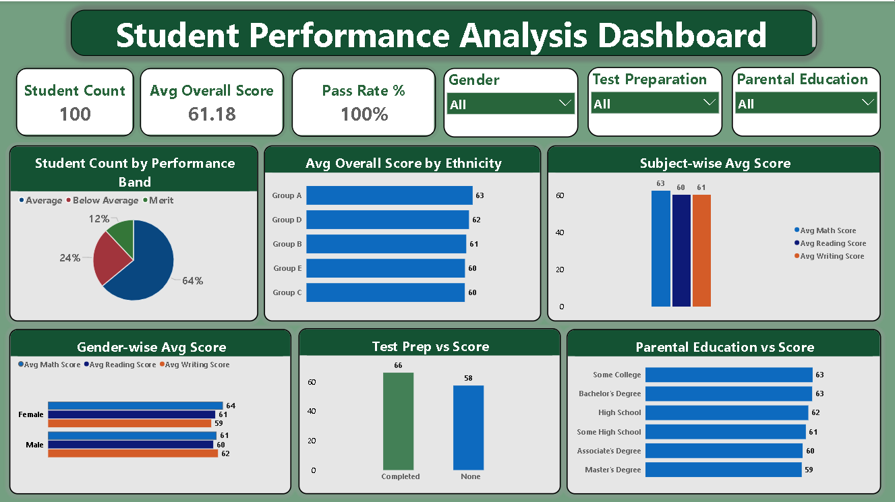

# 🎓 Student Performance Analysis — Syntecxhub Internship

> **Data Analyst Internship | Week 1 | Syntecxhub**

---

## 📌 Overview

An interactive Power BI dashboard analyzing student exam performance across Math, Reading, and Writing subjects. The project identifies key factors that influence academic outcomes — including parental education level, test preparation, ethnicity, and gender — visualized through a clean Dark Green & White themed dashboard.

---

## 🛠️ Tools & Technologies

| Tool | Usage |
|------|-------|
| Power BI Desktop | Dashboard creation & visualization |
| DAX | Calculated columns & measures |
| Power Query (M) | Data preprocessing |

---

## 📂 Dataset

- **Name:** student_performance_100.xlsx
- **Total Students:** 100
- **Columns:** Student ID, Gender, Ethnicity, Parental Education, Test Preparation, Math Score, Reading Score, Writing Score
- **Score Range:** 30 – 97

---

## 📊 Dataset Breakdown

| Field | Values |
|-------|--------|
| Gender | Male, Female |
| Ethnicity | Group A, Group B, Group C, Group D, Group E |
| Parental Education | High School, Some High School, Some College, Associate's Degree, Bachelor's Degree, Master's Degree |
| Test Preparation | Completed, None |

---

## ✅ Key Features

- ✔ Subject-wise average score comparison (Math, Reading, Writing)
- ✔ Performance Band classification (Merit, Average, Below Average)
- ✔ Gender-wise score comparison across all subjects
- ✔ Impact of test preparation on overall score
- ✔ Parental education level vs average score
- ✔ Ethnicity-wise average score comparison
- ✔ KPIs: Total Students, Avg Overall Score, Pass Rate %
- ✔ Interactive slicers: Gender, Test Preparation, Parental Education

---

## 📐 DAX Formulas Used

```dax
Overall Score = 
('student_performance_100'[Math Score] + 
 'student_performance_100'[Reading Score] + 
 'student_performance_100'[Writing Score]) / 3

Performance Band = 
SWITCH(
    TRUE(),
    'student_performance_100'[Overall Score] >= 70, "Merit",
    'student_performance_100'[Overall Score] >= 55, "Average",
    'student_performance_100'[Overall Score] >= 40, "Below Average",
    "Fail"
)

Avg Overall Score = AVERAGE('student_performance_100'[Overall Score])

Pass Rate % = 
DIVIDE(
    COUNTROWS(FILTER('student_performance_100', 
    'student_performance_100'[Overall Score] >= 40)),
    COUNTROWS('student_performance_100'),
    0
) * 100

Total Students = COUNTROWS('student_performance_100')
```

---

## 🗂️ Files in This Repository

```
Syntecxhub_Student_Performance_Analysis/
│
├── Student_Performance_Analysis.pbix     # Power BI dashboard file
├── student_performance_100.xlsx          # Raw dataset
├── Dashboard_Screenshot.png              # Preview image
└── README.md                             # Project documentation
```

---

## 📸 Dashboard Preview



---

## 💡 Key Insights

1. Students who completed **test preparation** scored ~8 points higher on average (66 vs 58).
2. **Math** is the highest scoring subject with an average of 63.
3. **Female students** outperform male students in Math and Reading.
4. Students with **Some College or Bachelor's Degree** parents score highest (63).
5. Students with **Master's Degree** parents surprisingly score lowest (59) in this dataset.
6. **Group A** students have the highest average score (63) among all ethnicity groups.
7. **64%** of students fall in the Average performance band (55–69 score range).

---

## 👤 Author

**Pranjal Waim**
B.Tech CSE — MIT College, Chh. Sambhajinagar
Data Analyst Intern @ Syntecxhub

[](https://linkedin.com/in/pranjal)

---

*Submitted as part of Syntecxhub Data Analyst Internship Program — Week 1*
